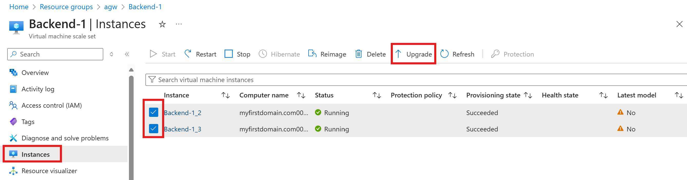
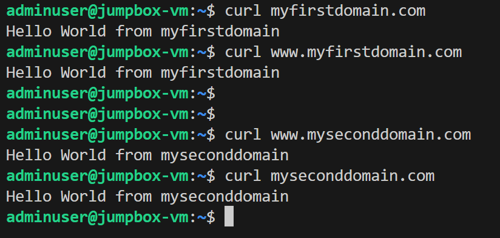

## Direct web traffic to multiple web sites with Azure Application Gateway

### Demo Link: https://learn.microsoft.com/en-us/azure/application-gateway/create-multiple-sites-portal

  

Azure Application Gateway is a load balancer that enables you to manage and optimize the traffic to your web applications. \
Since upgrade mode for the backend VMSS is set to "Manual", a manual upgrade is required after provisioning of the VMSS. \
Go to the VMSS resource --> Click "Instances" --> Select the VM instances you want to upgrade --> Click "Upgrade".

Now test the Application gateway frontend IP to validate the you can reach the backend.

## Expected Results
