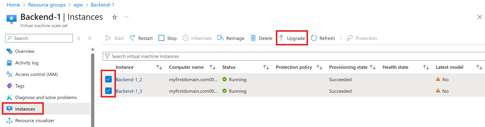
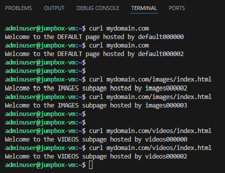

<!-- BEGIN_TF_DOCS -->
## Application gateway with path-based routing rules

### Demo Link: https://learn.microsoft.com/en-us/azure/application-gateway/create-url-route-portal

<p align="center">
  
</p>

URL paths are "/images/*" and "/videos/*"

Azure Application Gateway is a load balancer that enables you to manage and optimize the traffic to your web applications.

Add the Frontend IP (public/private) of App Gateway to the host file (/etc/hosts) of the jumpbox to test connectivity
```hcl
  user_data = base64encode(<<-EOF
              #!/bin/bash
              echo -e "${azurerm_public_ip.agw_pip.ip_address} www.mydomain.com"\\n >> /etc/hosts
              echo -e "${azurerm_public_ip.agw_pip.ip_address} mydomain.com"\\n >> /etc/hosts
              EOF
  )

```
Since upgrade mode for the backend VMSS is set to "Manual", a manual upgrade is required after provisioning of the VMSS. \
Go to the VMSS resource --> Click "Instances" --> Select the VM instances you want to upgrade --> Click "Upgrade".



Now test the Application gateway frontend IP to validate the you can reach the backend.

## Expected Results


## Requirements

| Name | Version |
|------|---------|
| <a name="requirement_azurerm"></a> [azurerm](#requirement\_azurerm) | ~> 4.28 |
| <a name="requirement_http"></a> [http](#requirement\_http) | ~> 3.5 |
| <a name="requirement_random"></a> [random](#requirement\_random) | ~> 3.5 |

## Modules

| Name | Source | Version |
|------|--------|---------|
| <a name="module_naming"></a> [naming](#module\_naming) | git::https://github.com/Azure/terraform-azurerm-naming.git | 75d5afae |

## Resources

| Name | Type |
|------|------|
| [azurerm_application_gateway.appGW](https://registry.terraform.io/providers/hashicorp/azurerm/latest/docs/resources/application_gateway) | resource |
| [azurerm_linux_virtual_machine.jumpbox_vm](https://registry.terraform.io/providers/hashicorp/azurerm/latest/docs/resources/linux_virtual_machine) | resource |
| [azurerm_linux_virtual_machine_scale_set.backend1](https://registry.terraform.io/providers/hashicorp/azurerm/latest/docs/resources/linux_virtual_machine_scale_set) | resource |
| [azurerm_linux_virtual_machine_scale_set.backend2](https://registry.terraform.io/providers/hashicorp/azurerm/latest/docs/resources/linux_virtual_machine_scale_set) | resource |
| [azurerm_linux_virtual_machine_scale_set.backend3](https://registry.terraform.io/providers/hashicorp/azurerm/latest/docs/resources/linux_virtual_machine_scale_set) | resource |
| [azurerm_nat_gateway.backend_nat_gw](https://registry.terraform.io/providers/hashicorp/azurerm/latest/docs/resources/nat_gateway) | resource |
| [azurerm_nat_gateway_public_ip_association.backend_assoc](https://registry.terraform.io/providers/hashicorp/azurerm/latest/docs/resources/nat_gateway_public_ip_association) | resource |
| [azurerm_network_interface.jumpbox_nic](https://registry.terraform.io/providers/hashicorp/azurerm/latest/docs/resources/network_interface) | resource |
| [azurerm_network_interface_security_group_association.ssh_in_assoc](https://registry.terraform.io/providers/hashicorp/azurerm/latest/docs/resources/network_interface_security_group_association) | resource |
| [azurerm_network_security_group.backend_nsg](https://registry.terraform.io/providers/hashicorp/azurerm/latest/docs/resources/network_security_group) | resource |
| [azurerm_network_security_group.jumpbox_nsg](https://registry.terraform.io/providers/hashicorp/azurerm/latest/docs/resources/network_security_group) | resource |
| [azurerm_network_security_rule.backend_rule](https://registry.terraform.io/providers/hashicorp/azurerm/latest/docs/resources/network_security_rule) | resource |
| [azurerm_network_security_rule.jumpbox_rule1](https://registry.terraform.io/providers/hashicorp/azurerm/latest/docs/resources/network_security_rule) | resource |
| [azurerm_public_ip.agw_pip](https://registry.terraform.io/providers/hashicorp/azurerm/latest/docs/resources/public_ip) | resource |
| [azurerm_public_ip.jumpbox_pip](https://registry.terraform.io/providers/hashicorp/azurerm/latest/docs/resources/public_ip) | resource |
| [azurerm_public_ip.nat_gw_pip](https://registry.terraform.io/providers/hashicorp/azurerm/latest/docs/resources/public_ip) | resource |
| [azurerm_resource_group.rg](https://registry.terraform.io/providers/hashicorp/azurerm/latest/docs/resources/resource_group) | resource |
| [azurerm_subnet.backend](https://registry.terraform.io/providers/hashicorp/azurerm/latest/docs/resources/subnet) | resource |
| [azurerm_subnet.frontend](https://registry.terraform.io/providers/hashicorp/azurerm/latest/docs/resources/subnet) | resource |
| [azurerm_subnet.jumpbox](https://registry.terraform.io/providers/hashicorp/azurerm/latest/docs/resources/subnet) | resource |
| [azurerm_subnet_nat_gateway_association.backend_assoc](https://registry.terraform.io/providers/hashicorp/azurerm/latest/docs/resources/subnet_nat_gateway_association) | resource |
| [azurerm_subnet_network_security_group_association.backend_inbound_assoc](https://registry.terraform.io/providers/hashicorp/azurerm/latest/docs/resources/subnet_network_security_group_association) | resource |
| [azurerm_virtual_machine_scale_set_extension.nginx_install_be1](https://registry.terraform.io/providers/hashicorp/azurerm/latest/docs/resources/virtual_machine_scale_set_extension) | resource |
| [azurerm_virtual_machine_scale_set_extension.nginx_install_be2](https://registry.terraform.io/providers/hashicorp/azurerm/latest/docs/resources/virtual_machine_scale_set_extension) | resource |
| [azurerm_virtual_machine_scale_set_extension.nginx_install_be3](https://registry.terraform.io/providers/hashicorp/azurerm/latest/docs/resources/virtual_machine_scale_set_extension) | resource |
| [azurerm_virtual_network.jumpbox_vnet](https://registry.terraform.io/providers/hashicorp/azurerm/latest/docs/resources/virtual_network) | resource |
| [azurerm_virtual_network.vnet](https://registry.terraform.io/providers/hashicorp/azurerm/latest/docs/resources/virtual_network) | resource |
| [http_http.ip](https://registry.terraform.io/providers/hashicorp/http/latest/docs/data-sources/http) | data source |

## Inputs

No inputs.

## Outputs

| Name | Description |
|------|-------------|
| <a name="output_jumpbox_pip"></a> [jumpbox\_pip](#output\_jumpbox\_pip) | n/a |
<!-- END_TF_DOCS -->