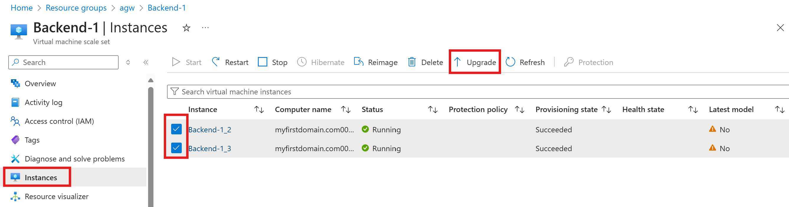
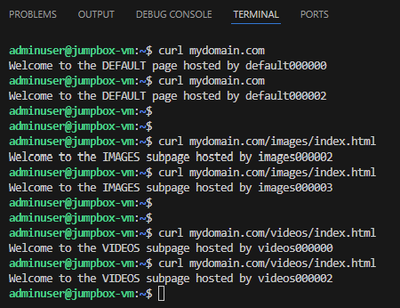

## Application gateway with path-based routing rules

### Demo Link: https://learn.microsoft.com/en-us/azure/application-gateway/create-url-route-portal

<p align="center">
  
</p>

URL paths are "/images/*" and "/videos/*"

Azure Application Gateway is a load balancer that enables you to manage and optimize the traffic to your web applications. 

Add the Frontend IP (public/private) of App Gateway to the host file (/etc/hosts) of the jumpbox to test connectivity
```hcl
  user_data = base64encode(<<-EOF
              #!/bin/bash
              echo -e "${azurerm_public_ip.agw_pip.ip_address} www.mydomain.com"\\n >> /etc/hosts
              echo -e "${azurerm_public_ip.agw_pip.ip_address} mydomain.com"\\n >> /etc/hosts
              EOF
  )

```
Since upgrade mode for the backend VMSS is set to "Manual", a manual upgrade is required after provisioning of the VMSS. \
Go to the VMSS resource --> Click "Instances" --> Select the VM instances you want to upgrade --> Click "Upgrade". 



Now test the Application gateway frontend IP to validate the you can reach the backend.

## Expected Results
